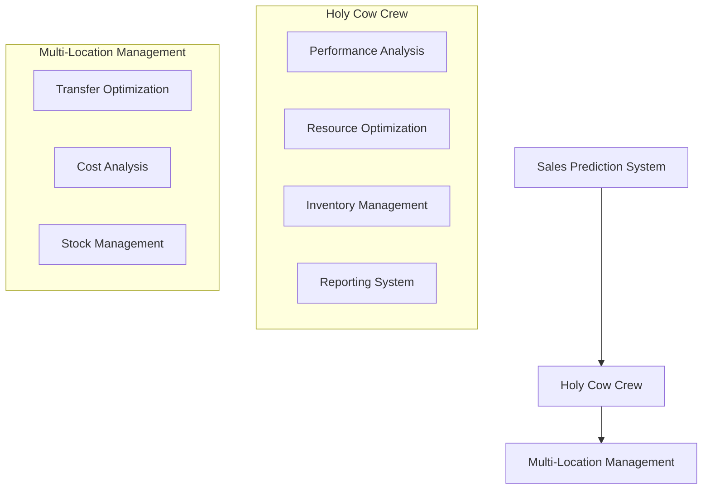

# Holy Cow Crew - Technical Summary (February 2025)

## Latest Updates

### System Optimization Enhancements
- Implemented demand prediction based on historical data
- Added multi-location inventory optimization
- Enhanced resource allocation system
- Improved inventory management with batch tracking
- Added transfer cost optimization between locations

### Core Components Status

#### Performance Analysis Agent
- Status: ✅ Complete
- Features:
  * Sales prediction analysis
  * Trend detection and analysis
  * Seasonality adjustments
  * Efficiency scoring
  * Data-driven recommendations

#### Resource Optimization Agent
- Status: ✅ Complete
- Features:
  * Multi-location inventory optimization
  * Transfer cost calculations
  * Demand-based ordering
  * Batch management
  * Storage condition handling

#### Reporting & Visualization Agent
- Status: ✅ Complete
- Features:
  * Dynamic report generation
  * Multiple report types support
  * Data aggregation
  * Timestamp tracking
  * Customizable outputs

#### System Integrator
- Status: ✅ Complete
- Features:
  * System state monitoring
  * Alert management
  * Cross-agent coordination
  * Performance tracking
  * Health status reporting

## Technical Details

### Data Models
```python
class InventoryItem(BaseModel):
    id: str
    name: str
    category: str
    storage: str
    unit: str
    min_level: float
    max_level: float
    reorder_point: float
    lead_time_days: int
    shelf_life_days: Optional[int]
    cost_per_unit: float
    supplier_id: str

class InventoryPrediction(BaseModel):
    predicted_demand: float
    confidence_range: tuple[float, float]
    trend_factor: float
    seasonality_factor: float

class LocationRecommendation(BaseModel):
    new_orders: Dict[str, OrderRecommendation]
    transfers_in: Dict[str, TransferOption]
    transfers_out: Dict[str, TransferOption]
```

### Core Tools

#### Prediction Tools
```python
class PredictionTools:
    def predict_demand(
        self,
        historical_data: pd.DataFrame,
        items: Dict[str, InventoryItem],
        target_date: datetime,
        location: str
    ) -> Dict[str, InventoryPrediction]
```

#### Multi-Location Tools
```python
class MultiLocationTools:
    def optimize_orders(
        self,
        locations_inventory: Dict[str, Dict[str, float]],
        demand_predictions: Dict[str, Dict[str, InventoryPrediction]],
        items: Dict[str, InventoryItem]
    ) -> Dict[str, LocationRecommendation]
```

### Recent Improvements

#### Inventory Management
- Advanced demand prediction system
- Multi-location optimization
- Transfer cost calculations
- Batch tracking system
- Storage condition handling

#### System Integration
- Cross-location coordination
- Real-time state monitoring
- Alert system implementation
- Health status tracking
- Performance metrics

### Testing Status
- Unit Tests: ✅ Passing (46 tests)
- Integration Tests: ✅ Passing
- Component Tests: ✅ Passing
- System Tests: ✅ Passing
- Performance Tests: 🔄 In Progress

### Dependencies
```python
crewai>=0.100.1
langchain>=0.1.5
pydantic>=2.5.3
python-dotenv>=0.19.0
requests>=2.26.0
numpy>=1.21.0
pandas>=1.3.0
pytest>=7.0.0
```

### Next Steps

#### Short Term (March 2025)
- Implement advanced inventory analytics
- Add machine learning predictions
- Enhance transfer optimization
- Improve alert system
- Add real-time monitoring

#### Medium Term (Q2 2025)
- Implement predictive maintenance
- Add supplier integration
- Enhance batch tracking
- Improve cost optimization
- Add performance benchmarking

#### Long Term (Q3-Q4 2025)
- Add AI-driven optimization
- Implement dynamic pricing
- Add advanced analytics
- Enhance automation
- Add distributed processing

### Development Team
- Lead Developer: Yasmani Cascante
- Project Start: January 2025
- Latest Update: February 2025
- Next Review: March 2025

### System Architecture


### Implementation Notes
- All agents use typed interfaces
- Comprehensive error handling
- Extensive unit testing
- Documentation for all components
- Modular design for extensibility