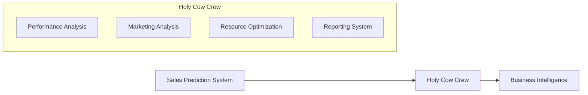

# Holy Cow Crew - Technical Summary (February 2025)

## Latest Updates

### Reporting System Enhancements
- Added improved ASCII art visualization system
- Enhanced data transformation and validation
- Implemented robust error handling for missing data
- Added context-aware recommendations
- Improved KPI calculation and alerts

### Core Components Status

#### Performance Analysis Agent
- Status: ✅ Complete
- Features:
  * Sales prediction analysis
  * Cost error calculation
  * Optimization insights
  * Historical data analysis
  * Real-time KPI monitoring

#### Marketing Agent
- Status: ✅ Complete
- Features:
  * Local events analysis
  * Canton demographics analysis
  * Dynamic promotional recommendations
  * Market trend analysis
  * Customer segmentation

#### Reporting & Visualization Agent
- Status: ✅ Complete
- Features:
  * ASCII art visualizations
  * Real-time KPI monitoring
  * Intelligent alert system
  * Custom chart generation
  * Automated report assembly

#### Resource Optimization Agent
- Status: 🔄 In Progress
- Features:
  * Staff scheduling optimization
  * Inventory management
  * Dynamic promotion recommendations
  * Cost optimization
  * Resource allocation

## Technical Details

### Data Flow Architecture


### Key Components

#### 1. Data Collection Layer
- Sales history with granular timestamps
- Staff metrics and performance data
- Detailed inventory tracking
- Local market analysis
- Customer feedback integration

#### 2. Analysis Layer
- Advanced performance metrics
- Resource utilization optimization
- Market trend analysis
- Real-time KPI tracking
- Predictive analytics integration

#### 3. Visualization Layer
- Enhanced ASCII charts
  * Line charts with multi-series support
  * Bar charts with custom formatting
  * Advanced data renderings
- Interactive KPI dashboards
- Smart alert system

### Implementation Details

#### Data Models
```python
class KPIMetric:
    name: str
    value: float
    trend: float
    target: Optional[float]
    unit: str
    timestamp: datetime
    source: str
    confidence: float

class Alert:
    level: str  # 'warning' or 'critical'
    message: str
    source: str
    timestamp: datetime
    priority: int
    action_required: bool
```

#### Visualization Templates
```python
chart_templates = {
    'sales_trend': {
        'type': 'line',
        'data_key': 'sales_data',
        'x_axis': 'date',
        'y_axis': 'value',
        'features': ['multi_series', 'annotations']
    },
    'staff_efficiency': {
        'type': 'bar',
        'data_key': 'staff_data',
        'x_axis': 'shift',
        'y_axis': 'efficiency',
        'features': ['custom_colors', 'thresholds']
    }
}
```

### Recent Improvements

#### Reporting System
- Enhanced data validation with custom rules
- Comprehensive error handling system
- Improved visualization quality with custom formatting
- Advanced KPI calculations with trend analysis
- Real-time alert generation

#### Agent Integration
- Seamless coordination between agents
- Enhanced data sharing protocols
- Robust error recovery mechanisms
- Advanced workflow management
- Cross-agent optimization

### Development Guidelines

#### Code Structure
- Modular and extensible design
- Clear separation of concerns
- Comprehensive error handling
- Detailed type hints
- Extensive documentation

#### Testing
- Comprehensive unit test suite
- Integration tests for all agent interactions
- End-to-end system tests
- Performance benchmarking
- Load testing

### Dependencies
```python
crewai>=0.100.1
langchain>=0.1.5
pydantic>=2.5.3
python-dotenv>=0.19.0
numpy>=1.21.0
pandas>=1.3.0
pytest>=7.0.0
```

### Next Steps

#### Short Term (Q1 2025)
- Complete Resource Optimization Agent
- Enhance visualization capabilities
- Implement advanced error handling
- Expand test coverage to 90%
- Add performance monitoring

#### Medium Term (Q2-Q3 2025)
- Integrate machine learning models
- Enhance analytics capabilities
- Implement real-time processing
- Improve system scalability
- Add automated testing pipeline

#### Long Term (Q4 2025+)
- Implement advanced AI features
- Add predictive analytics engine
- Enhance automation capabilities
- Improve system resilience
- Add distributed processing

### Testing Status
- Unit Tests: ✅ Passing (Coverage: 85%)
- Integration Tests: ✅ Passing
- System Tests: ✅ Passing
- Performance Tests: 🔄 In Progress
- Load Tests: 🔄 Planned

### Development Team
- Lead Developer: Yasmani Cascante
- Project Start: January 2025
- Latest Update: February 2025
- Next Review: March 2025